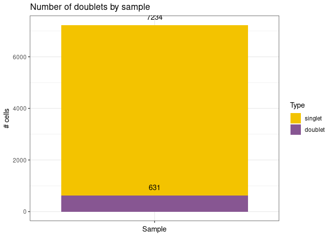
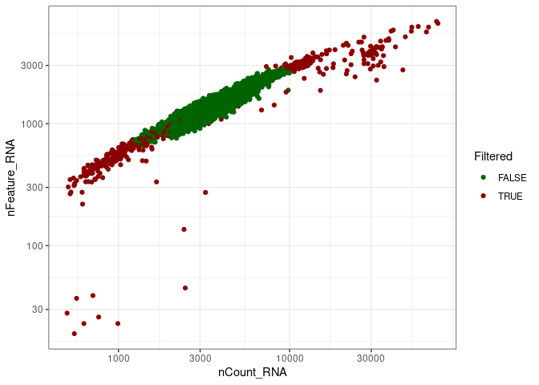
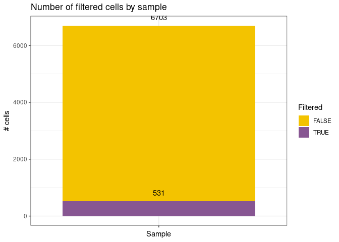
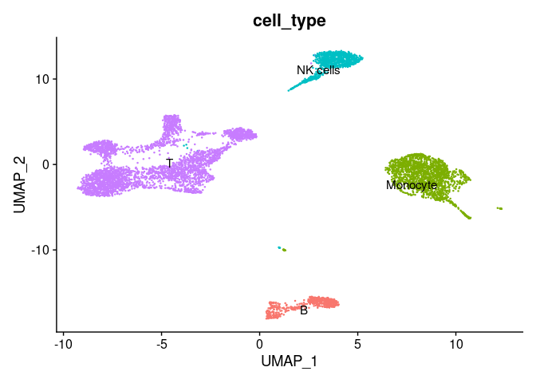

<!-- README.md is generated from README.Rmd. Please edit that file -->

# scLinear

<!-- badges: start -->
<!-- badges: end -->

The goal of scLinear is to predict antibody derived tags (ADT) data from
gene expression data in scRNA-seq data.

## Installation

You can install the development version of scLinear from
[GitHub](https://github.com/) with:

``` r
# install.packages("devtools")
devtools::install_github("DanHanh/scLinear")
```

## Get example data

``` r
set.seed(42)

library(scLinear)

## Example data from the Seurat PBMC10K example data set for the tutorial: https://satijalab.org/seurat/articles/multimodal_vignette.html.
# Download link: "https://support.10xgenomics.com/single-cell-gene-expression/datasets/3.0.0/pbmc_10k_protein_v3".
# File: "Feature / cell matrix (filtered)"

pbmc10k.data <- Seurat::Read10X(data.dir = "./local/raw_feature_bc_matrix/pbmc_10k_protein_v3_filtered_feature_bc_matrix/filtered_feature_bc_matrix")
rownames(x = pbmc10k.data[["Antibody Capture"]]) <- gsub(pattern = "_[control_]*TotalSeqB", replacement = "", x = rownames(x = pbmc10k.data[["Antibody Capture"]]))
pbmc10k <- Seurat::CreateSeuratObject(counts = pbmc10k.data[["Gene Expression"]], min.cells = 1, min.features = 1)
pbmc10k[["ADT"]] <- Seurat::CreateAssayObject(pbmc10k.data[["Antibody Capture"]][, colnames(x = pbmc10k)])
Seurat::DefaultAssay(pbmc10k) <- "RNA"
```

## Prepare data

``` r
pbmc10k <- prepare_data(pbmc10k,
        integrate_data = FALSE,
        annotation_selfCluster = TRUE, 
        remove_empty_droplets = FALSE)
#> [1] "Start remove doublets"
```



    #> [1] "Start low quality cell removal"



    #> [1] "Start clustering data"
    #> [1] "Number of used dimensions for clustering: 26"
    #> Modularity Optimizer version 1.3.0 by Ludo Waltman and Nees Jan van Eck
    #> 
    #> Number of nodes: 6703
    #> Number of edges: 285702
    #> 
    #> Running Louvain algorithm...
    #> Maximum modularity in 10 random starts: 0.8810
    #> Number of communities: 14
    #> Elapsed time: 0 seconds
    #> [1] "Start cell type annotation"
    #> Pre-defined cell type database panglaodb will be used.
    #> Multi Resolution Annotation Started. 
    #> Level 1 annotation started. 
    #> Level 2 annotation started. 
    #> Level 3 annotation started. 
    #> Level 4 annotation started. 
    #> Uniform Resolution Annotation Started.



## Train new model

``` r
## Create a training and a test set
indx <- sample(1:length(colnames(pbmc10k)), size = length(colnames(pbmc10k)), replace = FALSE)
pbmc10k_train <- pbmc10k[,indx[1:5000]]
pbmc10k_test <- pbmc10k[,indx[5001:length(colnames(pbmc10k))]]

## create predictor
pipe <- create_adt_predictor()

## train predictor
pipe <- fit_predictor(pipe = pipe,
 gexp_train = pbmc10k_train@assays[["RNA"]],
              adt_train = pbmc10k_train@assays[["ADT"]],
              normalize_gex = TRUE,
              normalize_adt = TRUE)

## evaluate predictor
eval_res <- evaluate_predictor(pipe = pipe,
                  gexp_test = pbmc10k_test@assays[["RNA"]],
                  adt_test = pbmc10k_test@assays[["ADT"]],
                  normalize_gex = TRUE,
                  normalize_adt = TRUE)

## add predicted adt assay
pbmc10k_test@assays["predicted_ADT"] <-  adt_predict(pipe = pipe,
                        gexp = pbmc10k_test@assays[["RNA"]],
                        normalize = TRUE)
```

## Use pretrained model

``` r
library(scLinear)

## subset pbmc data to only T-cells
t_cells <- pbmc10k %>% base::subset(subset = cell_type == "T")

pipe <- create_adt_predictor()
pipe$gex_preprocessor$do_log1p <- FALSE
## load pre-trained model (available models: all, bcell, tcell, nkcell)
pipe <- load_pretrained_model(pipe, model = "all")
pipe$gex_preprocessor$do_log1p <- FALSE

eval_res <- evaluate_predictor(pipe,
                t_cells@assays$RNA,
                t_cells@assays$ADT,
                normalize_gex = TRUE,
                normalize_adt = TRUE)
print(eval_res)
#> [[1]]
#> [1] 0.7209162
#> 
#> [[2]]
#> [1] 0.855126
#> 
#> [[3]]
#> [1] 0.7489931
```
