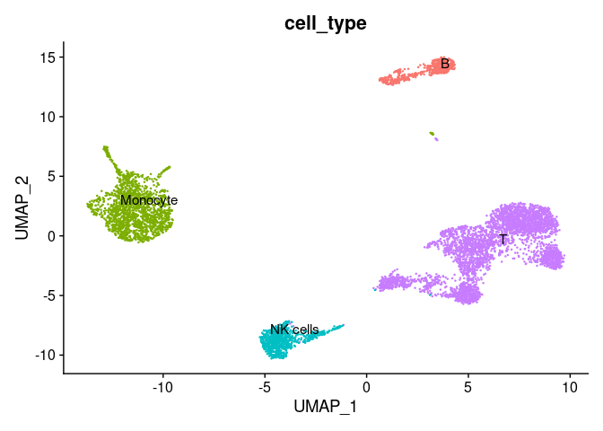

<!-- README.md is generated from README.Rmd. Please edit that file -->

# scLinear

<!-- badges: start -->
<!-- badges: end -->

The goal of scLinear is to …

## Installation

You can install the development version of scLinear from
[GitHub](https://github.com/) with:

``` r
# install.packages("devtools")
devtools::install_github("DanHanh/scLinear")
```

## Get example data

This is a basic example which shows you how to solve a common problem:

``` r
library(scLinear)

## get some example data from the Seurat PBMC10K example data set for the tutorial: https://satijalab.org/seurat/articles/multimodal_vignette.html.
# The download link: https://support.10xgenomics.com/single-cell-gene-expression/datasets/3.0.0/pbmc_10k_protein_v3.
# The File: "Feature / cell matrix (raw)"

pbmc10k.data <- Seurat::Read10X(data.dir = "./local/raw_feature_bc_matrix")
rownames(x = pbmc10k.data[["Antibody Capture"]]) <- gsub(pattern = "_[control_]*TotalSeqB", replacement = "", x = rownames(x = pbmc10k.data[["Antibody Capture"]]))
pbmc10k <- Seurat::CreateSeuratObject(counts = pbmc10k.data[["Gene Expression"]], min.cells = 1, min.features = 1)
pbmc10k[["ADT"]] <- Seurat::CreateAssayObject(pbmc10k.data[["Antibody Capture"]][, colnames(x = pbmc10k)])
Seurat::DefaultAssay(pbmc10k) <- "RNA"
```

## Prepare data

``` r
pbmc10k <- prepare_data(pbmc10k, integrate_data = FALSE, annotation_selfCluster = TRUE, remove_empty_droplets = TRUE)
#> [1] "Start remove doublets"
```


    #> [1] "Start low quality cell removal"


    #> [1] "Start clustering data"
    #> Modularity Optimizer version 1.3.0 by Ludo Waltman and Nees Jan van Eck
    #> 
    #> Number of nodes: 6792
    #> Number of edges: 302688
    #> 
    #> Running Louvain algorithm...
    #> Maximum modularity in 10 random starts: 0.8736
    #> Number of communities: 15
    #> Elapsed time: 0 seconds


    #> [1] "Start cell type annotation"
    #> Pre-defined cell type database panglaodb will be used.
    #> Multi Resolution Annotation Started. 
    #> Level 1 annotation started. 
    #> Level 2 annotation started. 
    #> Level 3 annotation started. 
    #> Level 4 annotation started. 
    #> Uniform Resolution Annotation Started.



## Train new model

``` r
## create a training and test set
set.seed(42)
indx <- sample(1:length(colnames(pbmc10k)), size = length(colnames(pbmc10k)), replace = FALSE)
pbmc10k_train <- pbmc10k[,indx[1:5000]]
pbmc10k_test <- pbmc10k[,indx[5001:length(colnames(pbmc10k))]]

## create predictor
pipe <- create_adt_predictor()

## train predictor
pipe <- fit_predictor(pipe = pipe, gexp_train = pbmc10k_train@assays[["RNA"]],
              adt_train = pbmc10k_train@assays[["ADT"]],
              normalize = TRUE)

## evaluate predictor
eval_res <- evaluate_predictor(pipe = pipe,
                  gexp_test = pbmc10k_test@assays[["RNA"]],
                  adt_test = pbmc10k_test@assays[["ADT"]],
                  normalize = TRUE)

## add predicted adt assay
pbmc10k_test@assays[["predicted_ADT"]] <-  adt_predict(pipe = pipe, gexp = pbmc10k_test@assays[["RNA"]], normalize = TRUE)
```

## Use pretrained model

``` r
library(scLinear)

## subset pbmc data to only T-cells
b_cells <- pbmc10k %>% base::subset(subset = cell_type == "T")

pipe <- create_adt_predictor()
pipe$gex_preprocessor$do_log1p <- FALSE
## load pre-trained model (available models: all, bcell, tcell, nkcell)
pipe <- load_pretrained_model(pipe, model = "all")

pipe$gex_preprocessor$do_log1p <- FALSE
evaluate_predictor(pipe, b_cells@assays$RNA, b_cells@assays$ADT, normalize = TRUE)
#> [[1]]
#> [1] 0.6037294
#> 
#> [[2]]
#> [1] 0.8506006
#> 
#> [[3]]
#> [1] 0.7471668
```

What is special about using `README.Rmd` instead of just `README.md`?
You can include R chunks like so:

``` r
summary(cars)
#>      speed           dist       
#>  Min.   : 4.0   Min.   :  2.00  
#>  1st Qu.:12.0   1st Qu.: 26.00  
#>  Median :15.0   Median : 36.00  
#>  Mean   :15.4   Mean   : 42.98  
#>  3rd Qu.:19.0   3rd Qu.: 56.00  
#>  Max.   :25.0   Max.   :120.00
```

You’ll still need to render `README.Rmd` regularly, to keep `README.md`
up-to-date. `devtools::build_readme()` is handy for this. You could also
use GitHub Actions to re-render `README.Rmd` every time you push. An
example workflow can be found here:
<https://github.com/r-lib/actions/tree/v1/examples>.

You can also embed plots, for example:


In that case, don’t forget to commit and push the resulting figure
files, so they display on GitHub and CRAN.
