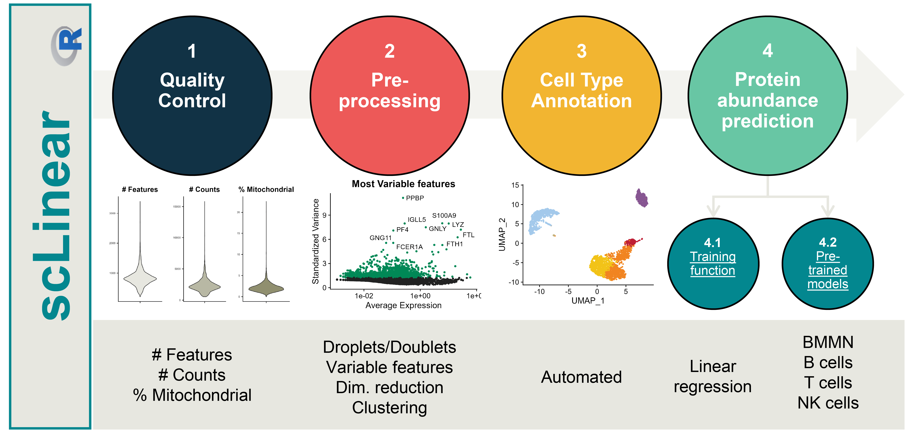
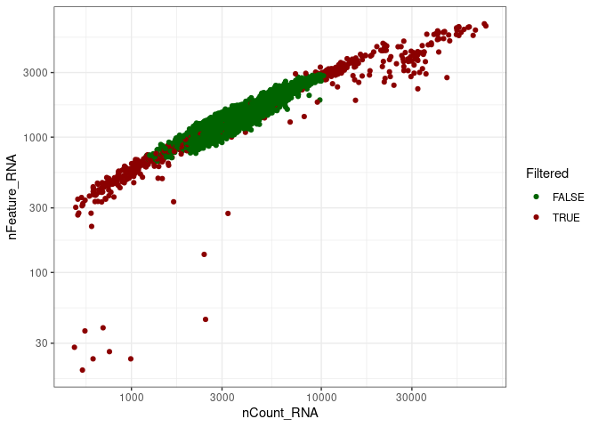
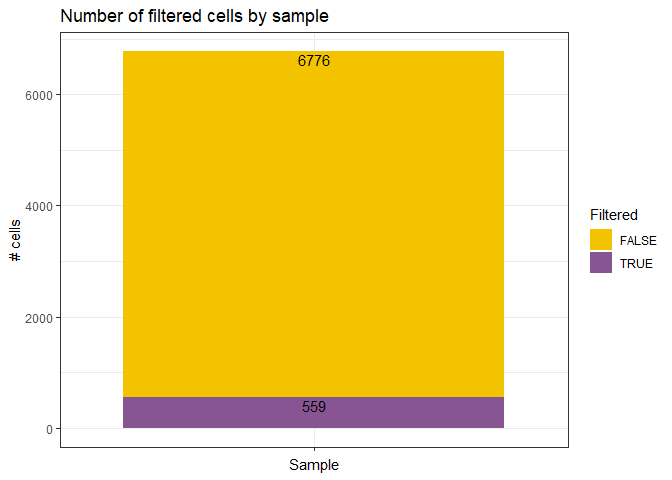
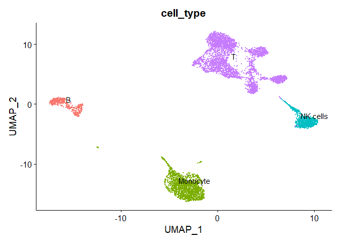

<!-- README.md is generated from README.Rmd. Please edit that file -->

# scLinear

<!-- badges: start -->
<!-- badges: end -->
The goal of scLinear is to predict antibody derived tags (ADT) data from
gene expression data in scRNA-seq data. It includes all the necessary
pre-processing steps, comes equiped with pre-trained models and also
allows the training of new models.  
<p align="center">

<p>

- [Installation](#Installation)
- [Example](#Example)
- [Other Functions](#Other-functions)
- [Citation](#Citation)
- [Contact us](#Contact-us)

## Installation

You can install the development version of scLinear using devtools.
Because of multiple issues with python dependencies not correctly
installed during package installation, I removed the automated
installation, of the dependencies for now and added them to the
installation guide (I will try to solve the issue in the future)

``` r
# Set up a python environment. I will use the renv package to create a new local environment. In case you want to use your default environment and r library, the first two commands can be scipped.
renv::init("./")
renv::use_python()

install.packages("devtools")
install.packages("reticulate")

# Get sure that the correct python environment is used by reticulate
reticulate::py_config()

#> python:         /path/to/renv/python/virtualenvs/renv-python-3.10/bin/python
#> libpython:      /usr/lib/python3.10/config-3.10-x86_64-linux-gnu/libpython3.10.so
#> pythonhome:     /path/to/renv/python/virtualenvs/renv-python-3.10:/path/to/renv/python/virtualenvs/renv-python-3.10
#> version:        3.10.12 (main, Nov 20 2023, 15:14:05) [GCC 11.4.0]
#> numpy:           [NOT FOUND]
#> 
#> NOTE: Python version was forced by RETICULATE_PYTHON


# Install all python dependencies (The version specified for scikit-learn & numpy should be yoused, if you want to use the pretrained models)
py_modules_list <- c("numpy<1.26.0","joblib","scikit-learn==1.2.0","anndata","warnings","scanpy")
for (m in py_modules_list){
  if(!reticulate::py_module_available(m)){reticulate::py_install(m)}
}
if(!reticulate::py_module_available("pytorch_lightning")){reticulate::py_install("pytorch_lightning", pip = TRUE)} # install with pip


# Test if all python dependencies are available
py_modules_list_available <- c("numpy","joblib","sklearn","anndata","warnings","torch","scanpy","os","scipy","typing", "pytorch_lightning")
py_modules_list_not_available <- c()
for (m in py_modules_list_available){
  if(!reticulate::py_module_available(m)){py_modules_list_not_available <- c(py_modules_list_not_available,m)}
}
if(is.null(py_modules_list_not_available)){ "All python modules are available"}else{
  print(paste0("The following python modules are not available: ", paste0(py_modules_list_not_available, collapse = ", ")))
  print("Try installing them with: reticulate::py_install(missing module name)")
}

#> [1] "All python modules are available"

# if the installation of scLinear fails, try restarting the R session, to reload the reticulate environment

# Install scLinear

if (!require("devtools", quietly = TRUE)){install.packages("devtools")}

devtools::install_github("DanHanh/scLinear", ref = "dev")
```

### Get data

The PBMC data can be downloaded from the 10X Genomics website
(<https://support.10xgenomics.com/single-cell-gene-expression/datasets/3.0.0/pbmc_10k_protein_v3>).
Then the following code can be used to generate a Seurat object.

``` r
library(scLinear)
set.seed(42)

# File: "Feature / cell matrix (filtered)"

# Download the cell matrix file into the local directory and untar it
dir.create("local", showWarnings = FALSE)
url <- "https://cf.10xgenomics.com/samples/cell-exp/3.0.0/pbmc_10k_protein_v3/pbmc_10k_protein_v3_filtered_feature_bc_matrix.tar.gz"
destfile <-"local/pbmc_10k_protein_v3_filtered_feature_bc_matrix.tar.gz"   
download.file(url, destfile)
untar(destfile, exdir = "local")

# Create a Seurat object from the data
data_dir <- "local/filtered_feature_bc_matrix"
pbmc10k.data <- Seurat::Read10X(data.dir = data_dir)
rownames(x = pbmc10k.data[["Antibody Capture"]]) <- gsub(pattern = "_[control_]*TotalSeqB", replacement = "", x = rownames(x = pbmc10k.data[["Antibody Capture"]]))
pbmc10k <- Seurat::CreateSeuratObject(counts = pbmc10k.data[["Gene Expression"]], min.cells = 1, min.features = 1)
pbmc10k[["ADT"]] <- Seurat::CreateAssayObject(pbmc10k.data[["Antibody Capture"]][, colnames(x = pbmc10k)])
Seurat::DefaultAssay(pbmc10k) <- "RNA"

saveRDS(pbmc10k, "./local/pbmc10k.rds")
```

### Running scLinear

You may run scLinear directly providing the Seurat object as input. List
of optional parameters:

- `remove_doublets` Removal of doublets. TRUE (default) or FALSE.  
- `low_qc_cell_removal` Removal of low quality cells. TRUE (default) or
  FALSE.  
- `anno_level` Level of annotation. 1, 2, 3 or 4. See
  <https://github.com/JiaLiVUMC/scMRMA> for more details.  
- `samples` NULL (default).  
- `integrate_data` TRUE or FALSE (default).  
- `remove_empty_droplets` Removal of empty droplets. TRUE or FALSE
  (default).  
- `lower` = 100 (default).  
- `FDR` = 0.01 (default).  
- `annotation_selfCluster` TRUE or FALSE (default).  
- `resolution` = 0.8 (default).  
- `seed` = 42 (default).  
- `return_plots` TRUE or FALSE (default).  
- `model` Available models “all” (default), “bcell”, “tcell” and
  “nkcell”.  
- `assay_name` = “RNA” (default).  
- `print_plots` TRUE or FALSE (default).

The scLinear function uses the counts slot from the RNA assay to predict
the ADT assay. The functions performs the default preprocessing steps
and returns a Seurat object with the added “predicted_ADT” assay

## The simplest way to use scLinear is to use the scLinear() function directly

``` r
pbmc10k <- readRDS("./local/pbmc10k.rds")
pbmc10k_adt_predicted <- scLinear(pbmc10k)
#> [1] "Start remove doublets"
#> [1] "Start low quality cell removal"
#> [1] "Start clustering data"
#> [1] "Number of used dimensions for clustering: 25"
#> [1] "Start cell type annotation"
#> Pre-defined cell type database panglaodb will be used.
#> Multi Resolution Annotation Started. 
#> Level 1 annotation started. 
#> Level 2 annotation started. 
#> Level 3 annotation started. 
#> Level 4 annotation started. 
#> Uniform Resolution Annotation Started.
```

## Other functions

scLinear calls different sub-workflows which can also be called
independently.

## Prepare data

``` r
pbmc10k <- readRDS("./local/pbmc10k.rds")
pbmc10k <- prepare_data(pbmc10k,
        integrate_data = FALSE,
        annotation_selfCluster = TRUE, 
        remove_empty_droplets = FALSE)
#> [1] "Start remove doublets"
```


    #> [1] "Start low quality cell removal"



    #> [1] "Start clustering data"
    #> [1] "Number of used dimensions for clustering: 25"
    #> [1] "Start cell type annotation"
    #> Pre-defined cell type database panglaodb will be used.
    #> Multi Resolution Annotation Started. 
    #> Level 1 annotation started. 
    #> Level 2 annotation started. 
    #> Level 3 annotation started. 
    #> Level 4 annotation started. 
    #> Uniform Resolution Annotation Started.



``` r
saveRDS(pbmc10k ,"./local/pbmc10k_prepared.rds")
```

### Use a pre-trained model

User may manually load pre-trained models (available models: all, bcell,
tcell, nkcell). If a pretrained model is used it is advided to use the
raw data slot from the RNA assay, and normalization = TRUE, to ensure
that the input data is normalized the same way as for the training data.
`adt_predict()` is then used to predict the ADT values with
parameters:  
\* `pipe` Pretrained model. \* `gexp` Gene expression matrix. \* `slot`
Seurat slot to use. “counts” (default) \* `normalize` TRUE (default) or
FALSE. An example can be found below:

``` r
pbmc10k <- readRDS("./local/pbmc10k_prepared.rds")

pipe <- create_adt_predictor()
pipe <- load_pretrained_model(pipe, model = "all")

pbmc10k@assays["predicted_ADT"] <-  adt_predict(pipe = pipe,
                        gexp = pbmc10k@assays[["RNA"]],
                        normalize = TRUE)
saveRDS(pbmc10k ,"./local/pbmc10k_predicted.rds")
```

## Train a new model

To train a new model the following commands need to be used.  
`create_adt_predictor()` to initialize predictor.  
`fit_predictor()` with parameters: \* `pipe` predictor initialized
above.  
\* `gexp_train` gene expression matrix of training set (i.e. RNA assay
from Seurat object).  
\* `adt_train` ADT matrix of training set.  
\* `normalize_gex` Gene expression normalization. TRUE (default) or
FALSE. \* `normalize_adt` ADT normalization. TRUE (default) or FALSE.

Subsequently, the `evaluate_predictor` command can be used (same
parameters with `fit_predictor`) to return the RMSE, Pearson and
Spearman of the training process. An example of this process can be
found below.

``` r
pbmc10k <- readRDS("./local/pbmc10k_prepared.rds")
## Create a training and a test set
set.seed(42)
indx <- sample(1:length(colnames(pbmc10k)), size = length(colnames(pbmc10k)), replace = FALSE)
pbmc10k_train <- pbmc10k[,indx[1:5000]]
pbmc10k_test <- pbmc10k[,indx[5001:length(colnames(pbmc10k))]]

## create predictor
pipe <- create_adt_predictor()

## train predictor
pipe <- fit_predictor(pipe = pipe,
 gexp_train = pbmc10k_train@assays[["RNA"]],
              adt_train = pbmc10k_train@assays[["ADT"]],
              normalize_gex = TRUE,
              normalize_adt = TRUE)

## save the trained model
save_trained_model(pipe = pipe, file = "./local/trained_model.joblib")
#> NULL

# load the trained model
pipe <- create_adt_predictor()
pipe <- load_pretrained_model(pipe, file = "./local/trained_model.joblib")

## evaluate predictor
eval_res <- evaluate_predictor(pipe = pipe,
                  gexp_test = pbmc10k_test@assays[["RNA"]],
                  adt_test = pbmc10k_test@assays[["ADT"]],
                  normalize_gex = TRUE,
                  normalize_adt = TRUE)
#> RMSE: 0.35243118253148364
#> Pearson correlation: 0.9411908520410573
#> Spearman correlation: 0.8725401159661871

print(eval_res)
#>        RMSE   Pearson  Spearman
#> 1 0.3524312 0.9411909 0.8725401

## add the predicted adt assay
pbmc10k_test[["predicted_ADT"]] <-  adt_predict(pipe = pipe,
                        gexp = pbmc10k_test@assays[["RNA"]],
                        normalize = TRUE)
```

## Citation

Daniel Hanhart et al., “ScLinear predicts protein abundance at
single-cell resolution”

DOI: <https://doi.org/10.1038/s42003-024-05958-4>

## Contact us

For any request or question you may contact: \* Daniel Hanhart
<daniel.hanhart@unibe.ch> \* Panagiotis Chouvardas
<panagiotis.chouvardas@unibe.ch>
